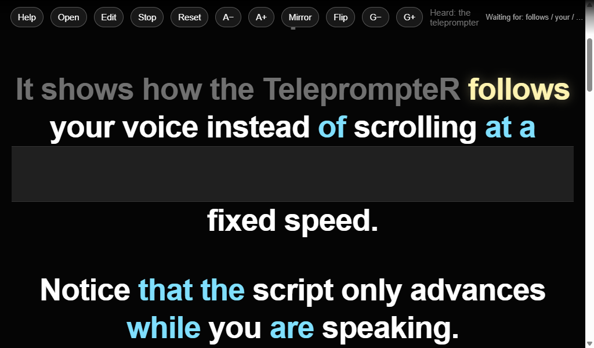

# Voice Teleprompter

Voice Teleprompter is a lightweight browser-based teleprompter that follows your speech instead of scrolling at a fixed speed.

Simply keep the application files together and open `index.html` in Google Chrome. No installation, server or subscription is required.

## Why Voice Teleprompter?

Unlike timer-based teleprompters, Voice Teleprompter waits for you.

You can pause naturally, demonstrate hardware, think about your next point, or restart a take without losing your place.

Instead of relying on perfect speech-to-text transcription, Voice Teleprompter tracks your position using a lightweight required/optional word recognition system designed specifically for technical presentations.

## Features

### Voice-controlled scrolling

- Follows your speech automatically
- No scrolling timers
- Pause naturally without losing your place
- Hands-free reset using the voice command **"Hey reset"**

### Intelligent speech tracking

Rather than attempting perfect speech-to-text transcription, Voice Teleprompter tracks your position through the script using a lightweight recognition engine.

Words are divided into two categories:

- **Required words** (white)
- **Optional words** (cyan)

This makes the teleprompter much more tolerant of speech recognition errors, particularly when reading technical terminology, acronyms, product names and common filler words.

## Eye Contact Mode

Eye Contact Mode creates an adjustable horizontal reading gap for a webcam positioned in front of your display.

The script automatically scrolls so the next lines to be read appear immediately above the webcam, helping you maintain much more natural eye contact while recording.

This helps maintain natural eye contact while reading the script, making recordings look much more natural.

The gap size can be adjusted using the **G−** and **G+** buttons and is remembered automatically.

## Mirror and Flip Modes

Voice Teleprompter supports two display transformations.

- **Mirror** reflects the script horizontally for use with beam-splitter teleprompter hardware.
- **Flip** rotates the script for displays mounted upside down.

The two modes can be used independently or together.

## Built-in Script Editor

- Edit scripts directly in the browser
- Open plain text (`.txt`) files
- Download edited scripts
- Automatically remembers the last script used

## Adjustable Display

- Adjustable font size
- Mirror mode for beam-splitter teleprompters
- Flip mode for inverted displays
- Adjustable Eye Contact gap
- Auto-hiding toolbar

## Help System

The built-in Help page includes:

- Controls reference
- Voice commands
- Recognition guide
- Required vs optional words
- Script statistics
- Adjustable reading speed
- Tips for improving recognition
- Chrome microphone setup instructions
- Eye Contact gap guide

## Script Statistics

Displays:

- Word count
- Sentence count
- Optional word count
- Estimated reading time

Reading time is calculated using an adjustable Words Per Minute (WPM) value.

## Recognition Tips

If a word is difficult for speech recognition, it can easily be made optional by using CamelCase or all CAPITALS.

| Required | Optional |
|----------|----------|
| Bluetooth | BlueTooth |
| Open Thread | OpenThread |
| rssi | RSSI |

Optional words are highlighted in **cyan**.

Optional words remain visible in the script but may be skipped by the recognition engine if the following required word is successfully recognised.

## Browser Support

Voice Teleprompter uses the browser's Web Speech API.

Recommended browser:

- Google Chrome

Voice Teleprompter has been developed and tested primarily with Google Chrome, which currently provides the most reliable speech recognition experience.

The built-in Help page includes instructions for selecting the correct microphone if Chrome is using the wrong input device.

## Privacy

Everything runs locally in your browser.

No scripts are uploaded anywhere.

All recognition is performed using your web browser's speech recognition service.

The application stores only the following in browser local storage:

- Last script
- Font size
- Reading speed
- Mirror mode
- Eye Contact gap size

## Installation

No installation is required.

Clone or download the repository, keeping all files together:

- `index.html`
- `help.html`
- `styles.css`
- `app.js`
- `version.js`

Then open **index.html** in Google Chrome.

## License

This project is licensed under the **Apache License 2.0**.

See the `LICENSE` file for details.